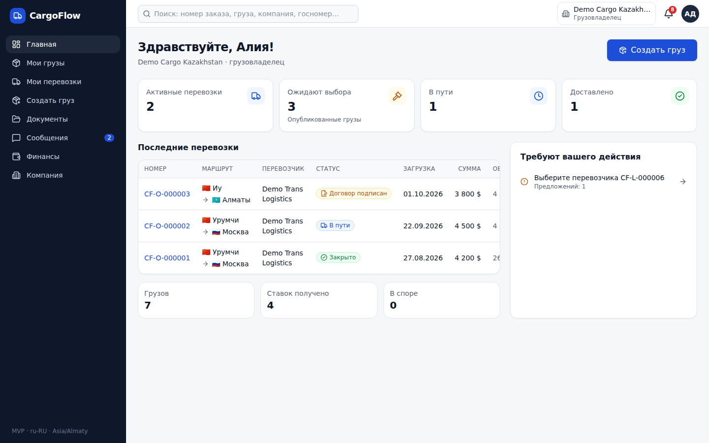
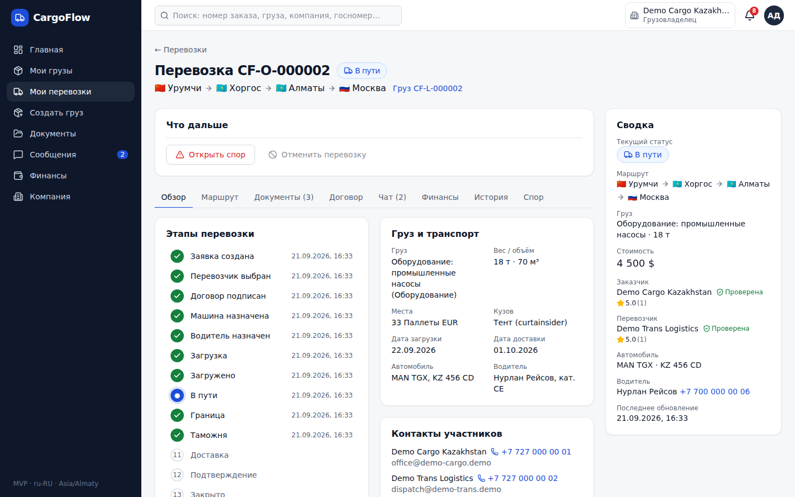
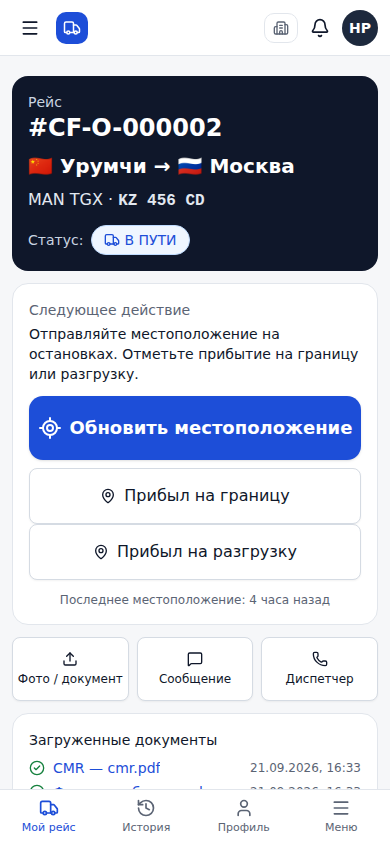

# CargoFlow

**CargoFlow** — SaaS-платформа для цифровизации международных автомобильных грузоперевозок (Китай — Казахстан — Центральная Азия — Россия и любые другие страны).

В одном месте участники перевозки:

**создают груз → публикуют на бирже → получают ставки и торгуются → выбирают перевозчика → формируют договор и подписывают его электронно → назначают автомобиль и водителя → водитель ведёт рейс из мобильного интерфейса (статусы, фото, геолокация) → документы, чат, финансы → доставка с POD → подтверждение получения → закрытие сделки → отзывы.**

Это рабочий MVP, а не прототип: все действия идут через backend, хранятся в PostgreSQL, проверяются по правам на сервере и пишутся в журнал аудита.

---

## 🚀 Быстрый старт (локально, в один клик)

Docker и ручная установка PostgreSQL **не нужны**: скрипт сам поставит Node.js (если его нет), зависимости и встроенный PostgreSQL 16, загрузит демо-данные и откроет браузер.

1. Скачайте проект: на GitHub нажмите **Code → Download ZIP** и распакуйте (или `git clone`).
2. Запустите файл двойным кликом:
   - **Windows:** `start-windows.bat`
   - **macOS:** `start-mac.command` (если macOS блокирует: правый клик → «Открыть»)
   - **Linux:** `bash start-linux.sh`
3. Первый запуск займёт 2–5 минут. Откроется http://localhost:3000.
   Вход: `shipper@cargoflow.demo` / `Demo1234!` (на странице входа есть кнопки для всех ролей).

Повторные запуски — тот же файл (быстро, данные сохраняются в `.local/pgdata`). Остановка — `Ctrl+C` в окне терминала.

Через терминал то же самое: `npm install && npm run setup && npm run local`.

## Скриншоты

| Dashboard | Перевозка | Водитель (mobile) |
| --- | --- | --- |
|  |  |  |

## 1. Что такое CargoFlow

| Роль                                           | Что делает                                                                                                                                                     |
| ---------------------------------------------- | -------------------------------------------------------------------------------------------------------------------------------------------------------------- |
| **Грузовладелец** (`SHIPPER`)                  | создаёт и публикует грузы, сравнивает ставки, торгуется, принимает предложение, подписывает договор, следит за рейсом, подтверждает получение, оставляет отзыв |
| **Руководитель перевозчика** (`CARRIER_ADMIN`) | биржа грузов, ставки, подписание договора, автопарк, водители, назначения, документы, финансы, сотрудники                                                      |
| **Диспетчер** (`CARRIER_DISPATCHER`)           | то же, что руководитель, кроме настроек компании, управления сотрудниками, подписи договора и редактирования финансов                                          |
| **Экспедитор** (`FORWARDER`)                   | создаёт грузы от имени клиента, выбирает перевозчиков, контролирует много перевозок одновременно                                                               |
| **Водитель** (`DRIVER`)                        | упрощённый мобильный экран «Мой рейс»: одна большая кнопка для следующего шага, фото, CMR, геолокация, чат                                                     |
| **Администратор** (`PLATFORM_ADMIN`)           | пользователи, компании, верификация, споры, журнал аудита, настройки платформы                                                                                 |

## 2. Tech stack

- **Next.js 16** (App Router, Server Components, Route Handlers, Turbopack), **React 19**, **TypeScript**
- **PostgreSQL 16** + **Prisma 7** (driver adapter `@prisma/adapter-pg`), миграции с ручными частичными уникальными индексами и CHECK-ограничениями
- **Tailwind CSS 4** + компоненты в стиле **shadcn/ui** на **Radix UI**, **lucide-react**, **sonner**
- **Zod 4** (общие схемы для форм и сервера), **React Hook Form**
- **MapLibre GL** (open-source; стиль/тайлы настраиваются), **pdf-lib** (PDF договоров с кириллицей, шрифт DejaVu Sans)
- Хранилище файлов: локальная ФС (dev) или любое **S3-совместимое** (MinIO, AWS S3 и др.)
- Тесты: **Vitest** (unit + integration на реальной БД), **Playwright** (E2E)
- ESLint, Prettier, Docker Compose

## 3. Requirements

- Node.js **20.9+** (рекомендуется 22 LTS), npm 10+
- PostgreSQL **16** (локально или через Docker)
- Для E2E: Chromium для Playwright (`npx playwright install chromium` или путь к существующему через `PLAYWRIGHT_CHROMIUM_PATH`)

## 4. Installation

```bash
git clone <repo> cargoflow && cd cargoflow
cp .env.example .env            # при необходимости поправьте значения
docker compose up -d            # PostgreSQL (+ БД cargoflow_test) и MinIO
npm install                     # postinstall выполнит prisma generate
npm run db:deploy               # применить миграции
npm run db:seed                 # демо-данные (ОЧИЩАЕТ базу!)
npm run dev                     # http://localhost:3000
```

## 5. Environment variables

Все переменные описаны в `.env.example`. Главные:

| Переменная                                 | Назначение                                                                                                                              |
| ------------------------------------------ | --------------------------------------------------------------------------------------------------------------------------------------- |
| `DATABASE_URL`                             | строка подключения PostgreSQL                                                                                                           |
| `TEST_DATABASE_URL`                        | **отдельная** БД для integration/E2E тестов (она очищается!)                                                                            |
| `APP_URL`                                  | публичный URL приложения (ссылки в письмах, проверка Origin)                                                                            |
| `APP_SECRET`                               | секрет ≥ 32 символов (`openssl rand -hex 32`)                                                                                           |
| `SESSION_TTL_DAYS`                         | срок жизни сессии                                                                                                                       |
| `STORAGE_DRIVER`                           | `local` или `s3`; для `s3` — `S3_ENDPOINT`, `S3_BUCKET`, `S3_ACCESS_KEY_ID`, `S3_SECRET_ACCESS_KEY`, `S3_REGION`, `S3_FORCE_PATH_STYLE` |
| `MAX_UPLOAD_MB`                            | лимит размера файла (по умолчанию 15)                                                                                                   |
| `EMAIL_DRIVER`                             | `log` — письма пишутся в лог сервера; `none` — отключено                                                                                |
| `TELEGRAM_BOT_TOKEN`, `WHATSAPP_API_TOKEN` | необязательные адаптеры уведомлений (для локального запуска не нужны)                                                                   |
| `NEXT_PUBLIC_MAP_STYLE_URL`                | стиль MapLibre; пусто — растровые тайлы OpenStreetMap                                                                                   |

Секреты в репозиторий не коммитятся (`.env*` в `.gitignore`, кроме `.env.example`).

## 6. PostgreSQL setup

Через Docker: `docker compose up -d postgres` — создаёт `cargoflow` и `cargoflow_test` (`docker/postgres-init.sql`).

Без Docker:

```sql
CREATE DATABASE cargoflow;
CREATE DATABASE cargoflow_test;
```

## 7. Prisma migration

```bash
npm run db:deploy     # применить миграции (prod/CI)
npm run db:migrate    # создать новую миграцию при изменении schema.prisma (dev)
npm run db:generate   # сгенерировать клиент (src/generated/prisma)
```

Миграция `prisma/migrations/*_init` дополнительно содержит то, что Prisma не выражает в схеме:
последовательности для номеров `CF-L/CF-O/CF-C`, частичные уникальные индексы (одна активная ставка перевозчика на груз, **одна принятая ставка на груз**, одна действующая подпись компании на версии договора, одна активная версия документа, один открытый спор на заказ) и CHECK-ограничения (вес > 0, цена ≥ 0, дата загрузки ≤ даты доставки, рейтинг 1–5 и др.). Уникальность `TransportOrder.loadId` гарантирует «один груз → одна сделка».

## 8. Seed

```bash
npm run db:seed        # или: npm run db:reset (сброс миграций + seed)
```

Seed **очищает базу** и проводит сделки **через настоящий сервисный слой** (транзакции, state machine, договоры с hash, аудит, уведомления), после чего сдвигает даты в прошлое. Создаются: 4 компании, демо-пользователи, автопарк, водители, 10 грузов (опубликованные, в торгах, черновик), перевозки во всех ключевых состояниях: закрытая (с отзывами), в пути (с трекингом, документами и чатом), с подписанным договором, ожидающая подписи (с историей торга), со спором. Все данные вымышлены.

## 9. Run development

```bash
npm run dev      # http://localhost:3000
```

Письма (сброс пароля, приглашения, уведомления) в dev выводятся в лог сервера как JSON-строки `email.dev`.

## 10. Run tests

```bash
npm run test:unit          # 40 unit-тестов: валидация, права, state machine, финансы, правила ставок, hash, часовые пояса
npm run test:integration   # 35 integration-тестов на TEST_DATABASE_URL: полный core flow, RBAC, конкурентность, идемпотентность, бизнес-правила
npm test                   # unit + integration
npm run test:e2e           # сборка + Playwright: полный сценарий в браузере + проверки RBAC/CSRF по HTTP
```

E2E поднимает `next start` на порту 3100 против `TEST_DATABASE_URL`, предварительно применяя миграции и seed. Если браузер Playwright не установлен:

```bash
PLAYWRIGHT_CHROMIUM_PATH=/path/to/chromium npm run test:e2e
```

## 11. Run build

```bash
npm run lint && npm run typecheck
npm run build && npm start
```

## 12. Production deployment

1. PostgreSQL 16 (managed), S3-совместимое хранилище с **приватным** bucket.
2. Переменные: `NODE_ENV=production`, `APP_URL=https://…` (cookie получают флаг `Secure`), сильный `APP_SECRET`, `STORAGE_DRIVER=s3` + `S3_*`, `EMAIL_DRIVER` по готовности адаптера.
3. `npm ci && npm run build`, затем при каждом релизе `npm run db:deploy`, запуск `npm start` за HTTPS-прокси (передающим `X-Forwarded-For`).
4. Либо `Dockerfile` (выполняет `prisma migrate deploy` при старте).
5. **Не запускайте seed в production** (он очищает БД; скрипт это блокирует).
6. Rate limiter в MVP хранится в памяти процесса — при нескольких инстансах замените реализацию `RateLimiter` на Redis (интерфейс в `src/lib/auth/rate-limit.ts`).

## 13. Demo accounts

Пароль для всех: **`Demo1234!`** (только локальная среда; на странице входа есть кнопки быстрого заполнения).

| Роль                                    | Email                       | Компания                |
| --------------------------------------- | --------------------------- | ----------------------- |
| Грузовладелец                           | `shipper@cargoflow.demo`    | Demo Cargo Kazakhstan   |
| Перевозчик (руководитель)               | `carrier@cargoflow.demo`    | Demo Trans Logistics    |
| Диспетчер                               | `dispatcher@cargoflow.demo` | Demo Trans Logistics    |
| Экспедитор                              | `forwarder@cargoflow.demo`  | Demo Forwarding         |
| Водитель (свободен — для демо-сценария) | `driver@cargoflow.demo`     | Demo Trans Logistics    |
| Водитель (сейчас в рейсе)               | `driver2@cargoflow.demo`    | Demo Trans Logistics    |
| Второй перевозчик (на проверке)         | `carrier2@cargoflow.demo`   | Demo Silk Road Carriers |
| Администратор                           | `admin@cargoflow.demo`      | —                       |

### Демо-сценарий «с нуля» (как в E2E)

1. `shipper@…` → «Создать груз»: Китай (Урумчи) → Алматы → Москва, 20 000 кг, тент, 4 500 USD → «Опубликовать груз».
2. `carrier@…` → «Биржа грузов» → груз → «Предложить цену» 4 200 USD.
3. `shipper@…` → уведомление → вкладка «Предложения» → «Принять предложение» → создаются перевозка и договор.
4. Обе стороны: вкладка «Договор» → галочка согласия + пароль → «Подписать документ».
5. `carrier@…` → «Назначить автомобиль» (Volvo FH, KZ 123 AB) → «Назначить водителя» (Demo Driver).
6. `driver@…` (удобно с телефона) → «Мой рейс»: Я прибыл на загрузку → фото → Груз загружен → Начать перевозку → Обновить местоположение → Прибыл на границу → таможня → Граница пройдена → Продолжить маршрут → Прибыл на разгрузку → «Груз доставлен» (приложить CMR/POD).
7. `shipper@…` → «Подтвердить получение груза» → перевозка **закрыта**, сформирован окончательный расчёт → «Оставить отзыв»; перевозчик тоже оставляет отзыв.

## 14. Architecture overview

```
Browser (RSC + client components)
   │  fetch JSON (REST, Idempotency-Key)            Server Components (чтение)
   ▼                                                        │
Route Handlers  src/app/api/**  ── route(): Origin/CSRF, сессия, rate limit, идемпотентность, единый JSON/ошибки
   │                                                        │
   └──────────────► Service layer  src/server/services/*  ◄─┘
                     ├─ access.ts — связь пользователя со сделкой/грузом (ownership), права роли в этой компании
                     ├─ order-core.ts — performTransitionInTx (блокировка строки → state machine → история → аудит → уведомления)
                     └─ load / bid / order / contract / document / tracking / chat / payment / review / dispute / company / fleet / admin …
                                   │
             lib: permissions, state-machine, audit, notifications (adapters), storage (adapters),
                  contracts (template, SHA-256, PDF, SignatureProvider), validation (Zod), i18n
                                   │
                            PostgreSQL (Prisma)
```

Ключевые решения:

- **Авторизация только на сервере.** UI скрывает недоступные действия, но каждый сервис проверяет: пользователь → членство в компании → роль → права (`src/lib/permissions`) → связь с объектом (`access.ts`). Водитель видит только свой рейс, без финансов и договора.
- **State machine** — один файл `src/lib/state-machine/order-state-machine.ts`: разрешённые переходы, кто может их выполнять, «ручные» и «системные» переходы, подписи кнопок водителя. Все переходы пишутся в `TransportOrderStatusHistory` и `AuditLog`.
- **Транзакции и конкурентность.** Принятие ставки, подписание, назначения, доставка, закрытие — одна транзакция с `SELECT … FOR UPDATE`; поверх — уникальные индексы БД. Проверено тестом «два одновременных принятия → одна сделка».
- **Идемпотентность.** Клиент отправляет `Idempotency-Key` на каждую критическую операцию; повтор возвращает сохранённый ответ. Плюс естественная идемпотентность (проверки статусов под блокировкой).
- **Договор.** Snapshot текста + данных при создании, SHA-256 hash; подпись фиксирует hash, пользователя, компанию, IP, user agent, время; PDF строится из snapshot (стабилен для версии).
- **Адаптеры для будущих интеграций:** `NotificationAdapter` (email/Telegram/WhatsApp), `StorageAdapter` (local/S3), `SignatureProvider` (внешняя ЭП), `TrackingProvider` (GPS/телематика), `Geocoder`, `RateLimiter`.
- **i18n.** Все подписи enum-ов, навигация и общие строки — в `src/lib/i18n/messages/ru.ts`; даты хранятся в UTC, показываются в `Asia/Almaty`, время точек маршрута вводится и отображается в часовом поясе точки.

### Формат API

```json
{ "success": true, "data": … }
{ "success": false, "error": { "code": "FORBIDDEN", "message": "У вас нет доступа к этой перевозке.", "fields": { … } } }
```

Коды ошибок — `src/lib/errors.ts` (`UNAUTHORIZED`, `FORBIDDEN`, `NOT_FOUND`, `VALIDATION_ERROR`, `INVALID_STATE_TRANSITION`, `BID_ALREADY_EXISTS`, `BID_ALREADY_ACCEPTED`, `LOAD_ALREADY_CONVERTED`, `VEHICLE_UNAVAILABLE`, `DRIVER_UNAVAILABLE`, `CONTRACT_ALREADY_SIGNED`, `DOCUMENT_NOT_ALLOWED`, `DELIVERY_NOT_ALLOWED`, `ORDER_ALREADY_CLOSED`, `DUPLICATE_ACTION`, `RATE_LIMITED`, `INTERNAL_ERROR`). Stack trace пользователю не отдаётся.

Основные endpoints: `auth/{register,login,logout,forgot-password,reset-password,switch-company}`, `companies/:id`, `companies/:id/verification`, `loads`, `loads/:id`, `loads/:id/{publish,cancel,bids,questions,documents}`, `bids/:id/{accept,reject,counter,respond,withdraw}`, `orders`, `orders/:id`, `orders/:id/{status,vehicle,driver,deliver,confirm-delivery,cancel,contract,documents,tracking,messages,payments,review,dispute,history}`, `contracts/:id/{sign,pdf}`, `documents/:id`, `documents/:id/download`, `notifications`, `notifications/:id/read`, `disputes`, `vehicles`, `drivers`, `search`, `admin/*`, `health`.

## 15. Folder structure

```
prisma/                 schema.prisma, migrations/, seed.ts
assets/fonts/           DejaVu Sans (кириллица в PDF)
src/
  app/
    (auth)/             login, register, forgot/reset-password, invite/[token]
    (app)/              dashboard, loads, marketplace, orders, vehicles, drivers, company, carriers, documents, messages, finance, …
    driver/             мобильный интерфейс водителя
    admin/              админ-панель
    api/                REST Route Handlers
  components/ui/        примитивы (shadcn-стиль): button, dialog, tabs, table, …
  components/common/    StatusBadge, DataTable, Pagination, ConfirmDialog, RouteTimeline, EmptyState, MoneyDisplay, …
  components/layout/    AppShell, NotificationBell, GlobalSearch, CompanySwitcher
  features/             loads, orders, chat, documents, tracking, driver, fleet, company, admin, audit, auth, profile
  lib/                  auth, permissions, state-machine, audit, api, storage, notifications, contracts, validation, i18n, geo, tracking
  server/services/      бизнес-логика
  generated/prisma/     сгенерированный Prisma Client (не коммитится)
tests/unit | integration | e2e
```

## 16. Main business flows

- **Груз:** 4-шаговый мастер (маршрут с произвольным числом точек → груз → транспорт → цена и публикация, preview), черновик/публикация, видимость «биржа» или «только приглашённые», редактирование до появления ставок, отмена (активные ставки отклоняются с уведомлением).
- **Торги:** одна активная ставка перевозчика на груз; встречная цена заказчика; ответ перевозчика (согласиться / своя цена); вся история переговоров сохраняется; срок действия ставки.
- **Принятие ставки:** Bid → ACCEPTED, остальные → REJECTED, Load → CARRIER_SELECTED, TransportOrder, Contract, уведомления, аудит — атомарно.
- **Договор:** автогенерация из шаблона, snapshot + hash, внутреннее электронное подписание (не КЭП) с повторным вводом пароля; после подписей обеих сторон — CONTRACT_SIGNED.
- **Рейс:** автомобиль (грузоподъёмность, статус, GPS, конфликты) → водитель (статус, пересечение рейсов, срок удостоверения, доступ к приложению) → статусы водителя с геолокацией → граница/таможня → разгрузка → доставка с POD → подтверждение получения → CLOSED (+ окончательный расчёт на остаток).
- **Отмена:** до подписания — любая сторона; после — только через спор/администратора (сообщение показывается в UI).
- **Изменение цены после подписания:** «Для изменения цены после подписания обратитесь к администратору» (точка расширения для дополнительных соглашений).
- **Споры:** открыть → перевозка DISPUTED → комментарии → администратор решает/отклоняет и возобновляет, закрывает или отменяет перевозку.
- **Верификация компаний:** загрузка документов → заявка → одобрить / отклонить / запросить исправления / приостановить / восстановить; история сохраняется.

## 17. Known MVP limitations

- Электронное подписание — внутреннее подтверждение (акцепт) на платформе, **не квалифицированная ЭП**. Шаблон договора демонстрационный и должен быть адаптирован юристами под применимое право.
- Геопозиция передаётся водителем из браузера по кнопке/при смене статуса — это не непрерывный GPS-трекинг. Карта использует публичные тайлы OSM (для production задайте собственный стиль через `NEXT_PUBLIC_MAP_STYLE_URL`).
- Геокодирование — локальный справочник основных городов коридора; для остальных координаты не заполняются (карта покажет доступные точки).
- Чат и уведомления обновляются опросом (5 с / 30 с), без WebSocket.
- Rate limiter и кэш — в памяти процесса (один инстанс).
- Email-провайдер не подключён (письма пишутся в лог); Telegram/WhatsApp — только интерфейсы.
- Платформа не проводит платежи — только финансовый учёт. Опасные грузы (ADR), таможенное оформление, страхование не реализованы.
- UI — только русская локаль (архитектура готова к добавлению языков).

## 18. Future integrations

Точки расширения уже заложены:

| Интеграция                                                                                                                                                 | Где подключать                                                                                 |
| ---------------------------------------------------------------------------------------------------------------------------------------------------------- | ---------------------------------------------------------------------------------------------- |
| Email / Telegram / WhatsApp                                                                                                                                | `src/lib/notifications/adapters.ts` (`NotificationAdapter`)                                    |
| Внешняя / квалифицированная ЭП                                                                                                                             | `src/lib/contracts/signature-provider.ts` (`SignatureProvider`)                                |
| GPS-трекеры, телематика, fleet-провайдеры                                                                                                                  | `src/lib/tracking/provider.ts` (`TrackingProvider`, `source = GPS_PROVIDER`)                   |
| Геокодер (Nominatim, 2GIS, Яндекс)                                                                                                                         | `src/lib/geo/geocoder.ts` (`Geocoder`)                                                         |
| Хранилище                                                                                                                                                  | `src/lib/storage/storage.ts` (`StorageAdapter`)                                                |
| Масштабирование rate limit                                                                                                                                 | `src/lib/auth/rate-limit.ts` (`RateLimiter` → Redis)                                           |
| Онлайн-платежи, страхование, таможенные брокеры, OCR документов, AI-ассистент, скоринг перевозчиков, оптимизация маршрутов, native-приложения, внешний API | сервисный слой уже изолирован от UI; REST API с единым форматом можно открыть внешним клиентам |
